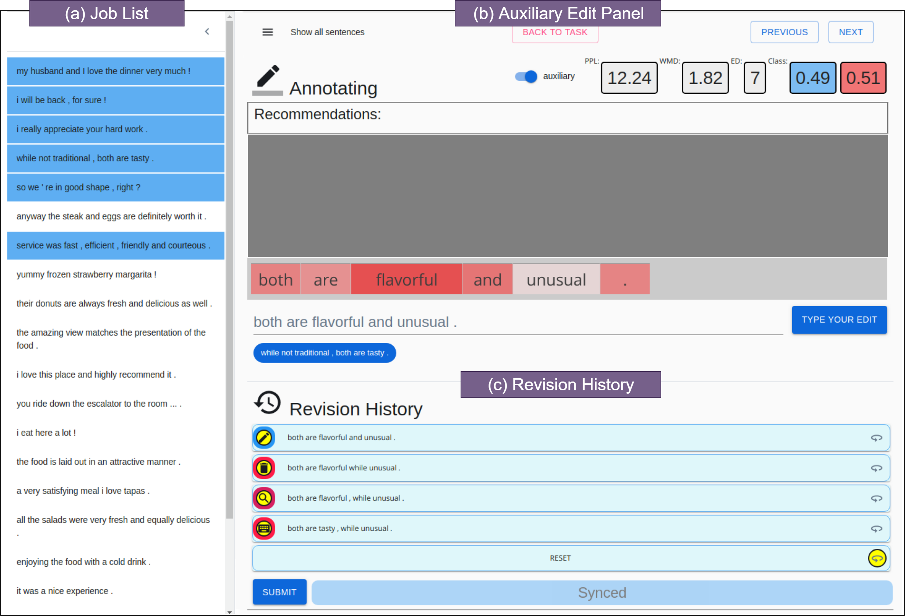

# ALTER

This is the project for "[ALTER: Auxiliary Text Rewriting Tool for Natural Language Generation](https://arxiv.org/pdf/1909.06564.pdf)" (EMNLP2019 demo) ([cite](#citation)). This tool aims at facilitating the rewriting process for natural language generation tasks by i) recording word-level revision histories and ii) incorporating flexible auxiliary edit support and instant feedback to annotators.

<p align="center">

</p>

##  1. Installation

### 1.1 Prerequisites
python, pytorch, docker

### 1.2 Backend Server

Go to web server folder `./service`. 

* (optional) It is recommended to work under a virtual environment by `virtualenv` or `conda env`.

* Install dependent packages:

```
make install
```

* Initialise the database:

```
make database.upgrade
```

* Initialise database with admin:

```
make seed
```

Username: admin
Password:  password


* Download models for auxiliary feedback components:
```bash
python src/manage.py download_models
```
1. **classifcation model:** is the model that predicts the probability of target labels. The default `gender_model`  ([model](http://users.cecs.anu.edu.au/~Qiongkai.Xu/c_e10_PPL0.388.pt), [vocab]( http://users.cecs.anu.edu.au/~Qiongkai.Xu/.vocab)) is trained on the task of gender classification, as described in our paper, is placed in `./data/gender_model`

3. **w2v** is a Word2Vector model ([GoogleNews-vectors-negative300.bin](https://s3.amazonaws.com/dl4j-distribution/GoogleNews-vectors-negative300.bin.gz)), which is placed in `data/models`.

4. **bert:** the bert model will be automatically downloaded to `data/models`, at the first request.

NB: You can adapt the models to your target tasks, by replacing the models in `data/models` or  `gender_model` and modifying the paths of corresponding models in `config.py`.


### 1.3 Frontend Webapp

The frontend webapp server runs in Docker.
Go to `./webapp` , and build the docker image:

```
docker build -t alter:latest .
```

## 2. Usage

### 2.1 Start the service

Start the backend server, under `./service`:

```bash
APPLICATION_HOST=0.0.0.0 APPLICATION_PORT=8000 ENVIRONEMENT=NO python src/server.py
```

Start the frontend webapp server, under`./webapp`:

```bash
docker run -d --rm -p 3000:3000 -v `pwd`:/app/webapp alter:latest /bin/bash -c "cd /app/webapp; npm start"
```

Visit the local website at:

[http://localhost:3000](http://localhost:3000)

Notice the default CORS check from modern browsers will stop you from accessing the framework except by [http://localhost:3000](http://localhost:3000). See section [deployment](#deployment) for following steps.

### 2.2 Stop the service

* Stop the backend API server by simply pressing "CTRL+C".
* Stop the frontend server by stopping the running container.

```
docker stop [CONTAINER_ID]
```

### 2.3 Deployment

We recommend deploying the server through reverse-proxy. We have provided a `nginx` setting as in `/deploy/fairedit.nginx`

(optional) If you need instant access to the website without `nginx` for now, you can add your external IP (say, 1.2.3.4 for both backend and fronend servers) to the server to bypass the CORS check.

1. Add your external IP to ALLOWED_ORIGINS`/service/src/config.py`, for example:

```python
ALLOWED_ORIGINS = ["http://localhost:3000", "http://1.2.3.4:3000"]
```

2. Run the webapp with the external IP of the backend server:

```
docker run -d --rm -p 3000:3000 -v `pwd`:/app/webapp alter:latest /bin/bash -c "cd /app/webapp; SERVICE_SERVER=http://1.2.3.4:8000/application npm start"
```

## 3. Export

A script function is provided to easily export all annotation jobs, with history of changes grouped into a single Json file for each job.

```
python3 src/manage.py export_jobs SAVE_DIR
```

## License

This project is under MIT License - see  [LICENSE](LICENSE) for more details.

## Citation

If you use this repository in your project, we would appreciate you citing our paper as below.

```
@inproceedings{qiongkai2019alter,
  title={ALTER: Auxiliary Text Rewriting Tool for Natural Language Generation},
  author={Qiongkai Xu, Chenchen Xu and Lizhen Qu},
  booktitle={2019 Conference on Empirical Methods in Natural Language Processing and 9th International Joint Conference on Natural Language Processing},
  pages={},
  year={2019},
  organization={SIGDAT}
}
```

